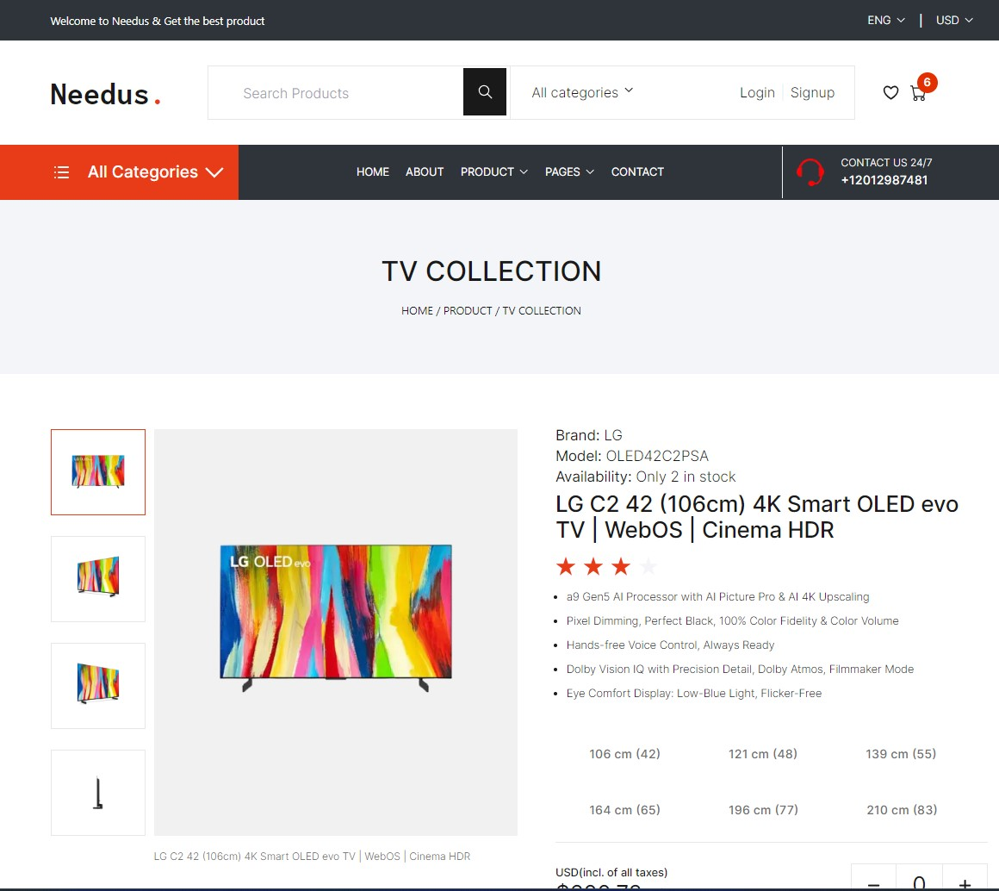
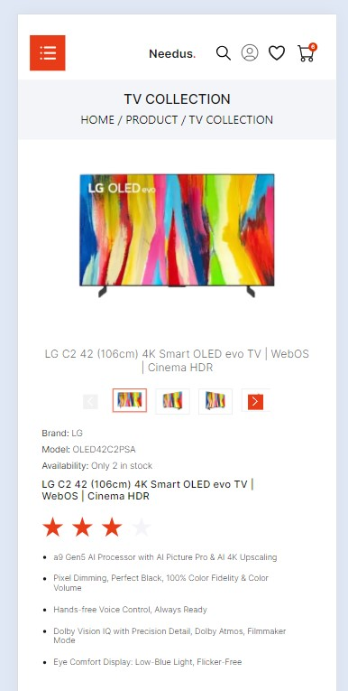

# Product Details Page / NextJS

## [Check it live here](https://kaleidoscopic-starship-fec600.netlify.app/)




A Product Details Page made with NextJS 14.2.2

## Getting Started

These instructions will get you a copy of the project up and running on your local machine for development and testing purposes. See deployment for notes on how to deploy the project on a live system.

### Installing

Clone the Repository and run

```
npm install
npm run dev
```

## Deployment

To deploy simply run

```
npm run build
```

## Built With

- [NextJS ](https://nextjs.org/)
- [ReactJS](https://reactjs.org/)
- [TypeScript](https://www.typescriptlang.org/)
- [TailwindCSS](https://tailwindcss.com/)
- [SwiperJS](https://swiperjs.com/)
- [HeadlessUI](https://headlessui.com/)
